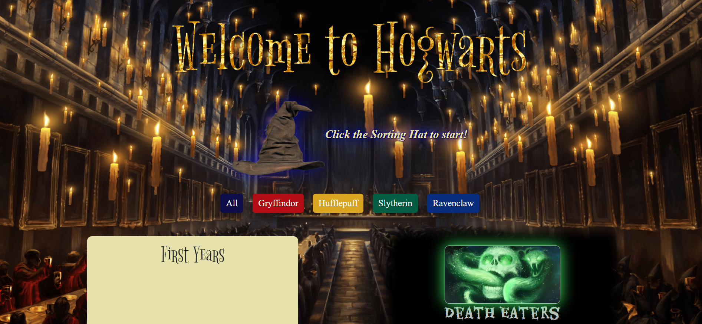
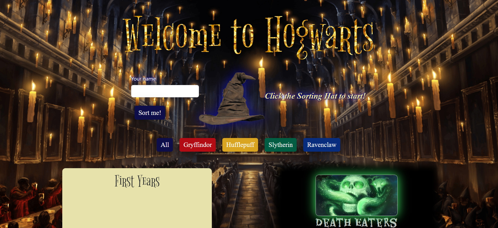
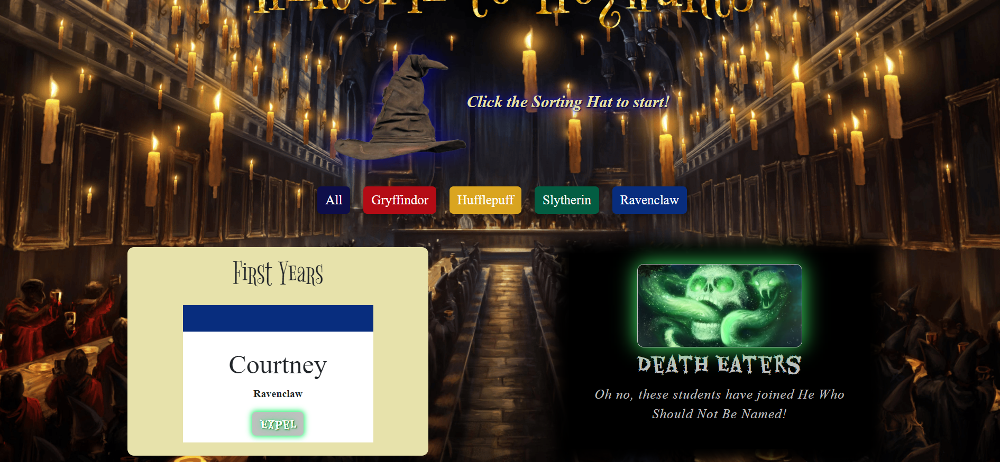

## Sorting Hat 

Sorting Hat lets you join your class at Hogwarts! Get sorted, view students by house, and even expel students to Voldemort's Army!

## About the User
- The ideal user for this application is a Harry Potter fanatic!
- The problem this app solves is it allows a user to be sorted randomly into their house.

## Features
- When a new student is added an object should be created and that object should be pushed into an array of students that then prints to the DOM.
- House Colors: The color of the student's card changes depending on which house they were sorted.
- Remove individual students from the student array and push them to separate array of Death Eaters, which then prints to the DOM.
- Use redeem to push expelled students back to Hogwarts!

## Video Walkthrough
https://www.loom.com/share/29122ba7019142659e279b025831fc3f?sid=11166d25-0b14-458f-bc62-5f4c93b99190

- [Check out the deployed site](https://voluble-torrone-2c2899.netlify.app/)
- [Project Board](https://github.com/users/cnfairall/projects/1/views/1)

## Project Screenshots

## Contributors
- [Courtney Fairall](https://github.com/cnfairall)
